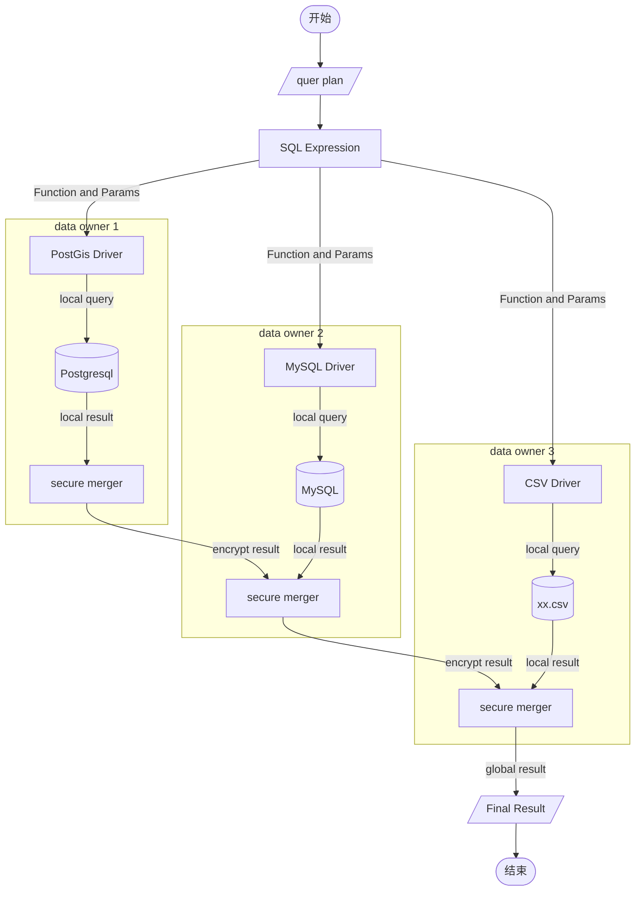

# DataFederateSystem

## Program Entry

```
com.suda.federate.application.Main.main()
```

## Requirement

* Apache Maven 3.6.0+
* Java 8
* PostgreSQL 13 + PostGIS 3.0
* MySQL 8.0+

## Start

- debug
  1. edit `config.json` and `query.json` in DataFederateSystem/src/main/resources
  1. run com.suda.federate.application.Main.main()


- release
  1. edit `config.json` and `query.json` in DataFederateSystem/release
  1. `package.sh`  or  `package.bat`
  1. ``run.sh` or `run.bat`


## Design

### workflow



## Function

### RangCount

函数原型

```java
public class FederateRangeCount{
    /**
     * query: select RangeCounting (P, radius) from table_name;
     * @param expression query expression (point, radius)
     * @return Integer，The number of points whose distance from P < radius in. table_name.
     */
    public static Integer publicQuery(SQLExpression expression)
    /**
     * query: select RangeCounting (P, radius) from table_name;
     * result: Integer，The number of points whose distance from P < radius in. table_name.
     *
     * @param point  query location
     * @param radius range count radius
     */
    public static Integer publicQuery(String tableName, Double radius, Point point);
    
    /**
     * query: select RangeCounting (P, radius) from table_name;
     * @param expression query expression (point, radius)
     * @return Integer，The number of points whose distance from P < radius in. table_name.
     */
    public static Integer privacyQuery(SQLExpression expression)
        
    /**
     * query: select RangeCounting (P, radius) from table_name;
     * @param tableName tableName target table name
     * @param radius range count query radius
     * @param point query location point
     * @param uuid identify this query
     * @return Integer，The number of points whose distance from P < radius in. table_name.
     */
    public static Integer privacyQuery(String tableName, Double radius, Point point, String uuid);
}

```

query.json

```json
{
    "function": "RangeCount",
    "table": "osm_sh",
    "params": [
      {
        "type": "point",
        "value": "121.456107 31.253359"
      },
      {
        "type": "Double",
        "value": 2500
      }
    ]
  }
```

### RangeQuery

函数原型

```java
public class FederateRangeQuery{
        /**
     * query: select RangeQuery (P, radius) from table_name
     * @param expression query expression
     * @return List<Point>，points whose distance from P < radius in table_name.
     */
    public static List<Point> publicQuery(SQLExpression expression);
    
    /**
     * query: select RangeQuery (P, radius) from table_name
     * @param tableName tableName target table name
     * @param radius range count query radius
     * @param point query location point
     * @return List<Point>，points whose distance from P < radius in table_name.
     */
    public static List<Point> publicQuery(String tableName, Double radius, Point point);
     /**
     * query: select RangeQuery (P, radius) from table_name
     * @param expression query expression
     * @return List<Point>，points whose distance from P < radius in table_name.
     */
    public static List<Point> privacyQuery(SQLExpression expression);
        /**
     * query: select RangeQuery (P, radius) from table_name
     * @param tableName tableName target table name
     * @param radius range count query radius
     * @param point query location point
     * @param uuid identify this query
     * @return List<Point>，points whose distance from P < radius in table_name.
     */
    public static List<Point> privacyQuery(String tableName, Double radius, Point point, String uuid);
}
```

query.json

```json
{
    "function": "RangeQuery",
    "table": "osm_sh",
    "params": [
      {
        "type": "point",
        "value": "121.456107 31.253359"
      },
      {
        "type": "Double",
        "value": 2500
      }
    ]
  }
```

### Knn

函数原型

```java
public class FederateKNN{
    
    /**
     * query: select publicKnn (P, K) from table_name;
     * @param expression query expression
     * @return List<Point>, The K nearest neighbors of point P in table_name.
     */
     public static List<Point> publicQuery(SQLExpression expression);
     /**
     * query: select public Knn (P, K) from table_name;
     * @param tableName target table name
     * @param k "K" nearest neighbors
     * @param point query location point
     * @return List<Point>, The K nearest neighbors of point P in table_name.
     */
	public static List<Point> publicQuery(String tableName, Integer k, Point point);
    /**
     * query: select privacy Knn (P, K) from table_name;
     * @param expression query expression
     * @return List<Point>, The K nearest neighbors of point P in table_name.
     */
    public static List<Point> privacyQuery(SQLExpression expression);
	/**
     * query: select privacy Knn (P, K) from table_name;
     * @param tableName target table name
     * @param k "K" nearest neighbors
     * @param point query location point
     * @param uuid identify this query
     * @return List<Point>, The K nearest neighbors of point P in table_name.
     */
	public static List<Point> privacyQuery(String tableName, Integer k, Point point, String uuid);
}
```

query.json

```json
{
    "function": "Knn",
    "table": "osm_sh",
    "params": [
      {
        "type": "int",
        "value": 10
      },
      {
        "type": "point",
        "value": "121 31"
      }
    ]
  }
```

## GRPC

### 编写步骤

- 编写.proto文件

创建 service 

```protobuf
service Federate {
	rpc RangeCount (SQLExpression) returns (SQLReply) {}
}
```

创建request message

```protobuf
message SQLExpression{
  optional int32 id =9;
  repeated int32 idList=10;
  ....
}
```

创建response message

```protobuf
message SQLReply {
  repeated int32 fakeLocalSum =2;
  required double message = 1;
}
```

- maven编译

配置proto编译后生成java路径

```xml
   <configuration>
                       <protocArtifact>com.google.protobuf:protoc:${protoc.version}:exe:${os.detected.classifier}</protocArtifact>
                       <pluginId>grpc-java</pluginId>
   <!--                    <&#45;&#45; 指定输出的base基础路径->-->
                       <outputDirectory>src/main/java</outputDirectory>
   <!--                    是否清除输出目录下的文件，默认为true，表示会将指定的输出路径下的全部文件都进行清空-->
   <!--                    如果自己配置了outputDirectory，请将这项配置改为false&ndash;&gt;-->
                       <clearOutputDirectory>false</clearOutputDirectory>
                   <pluginArtifact>io.grpc:protoc-gen-grpc-java:${grpc.version}:exe:${os.detected.classifier}</pluginArtifact>
                   </configuration>
```

运行maven，生成如下文件(rpc目录)

```java
package com.suda.federate.rpc;

public final class FederateService {
	...
}
```


### 通信过程

1. client端（发送request message）

   ```java
   package com.suda.federate.application;
   public final class FederateDBClient {
   	//客户端方法
   	private final FederateGrpc.FederateBlockingStub blockingStub; 
       public FederateService.SQLReply rangeCount(FederateService.SQLExpression expression){
           FederateService.SQLReply response;
           try{
               response = blockingStub.rangeCount(expression);
           }catch (StatusRuntimeException e){
               System.out.println("RPC调用失败："+e.getMessage());
               return null;
           }
           return response;
       }
   }
   ```

2. server端（接收request  message，返回response message）
	```java
   package com.suda.federate.silo;
   // 定义一个实现服务接口的类
   public abstract class FederateDBService extends FederateGrpc.FederateImplBase {
    
   }
   
   // silo 
   public class MysqlServer extends FederateDBServer {
           private static class FederateMysqlService<T> extends FederateDBService {
               //重写
               @Override
               public void rangeCount(FederateService.SQLExpression request, StreamObserver<FederateService.SQLReply> responseObserver) {
                   System.out.println("收到的信息：" + request.getFunction());
                   Integer result=0;
                   try {
   
                       result = localRangeCount(request.getPoint(),request.getTable(), request.getLiteral());
                       //构造返回
                       FederateService.SQLReply reply = setSummation(request,result);
                       responseObserver.onNext(reply);
                       responseObserver.onCompleted();
                   } catch (SQLException | InvocationTargetException | NoSuchMethodException | InstantiationException | IllegalAccessException e) {
                       e.printStackTrace();
                   }
               }
           }
	}
	
	```

其中`rpc RangeCount (SQLExpression) returns (SQLReply) {}` 

- 对应client端`blockingStub.rangeCount(expression);` 
- 和 server端的 `@Override public void rangeCount(FederateService.SQLExpression request, StreamObserver<FederateService.SQLReply> responseObserver)` 

