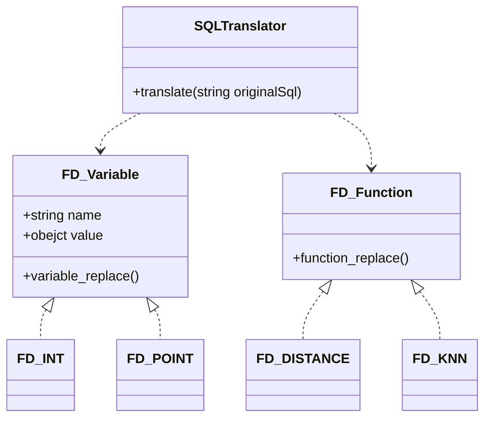
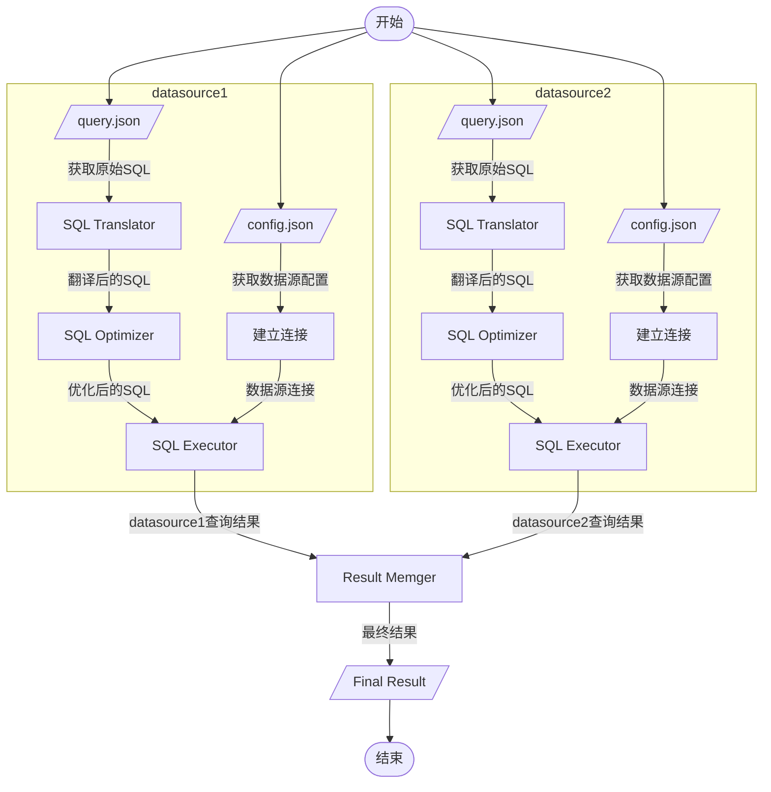

# DataFederateSystem

## Program entry

```
com.suda.federate.application.Main.main()
```

## Requirement

* Apache Maven 3.6.0+
* Java 8
* PostgreSQL 13 + PostGIS 3.0

## Start

### debug

1. edit `config.json` and `query.json` in DataFederateSystem/src/main/resources
2. run com.suda.federate.application.Main.main()

## release

1. edit `config.json` and `query.json` in DataFederateSystem/release
2. `package.sh`  or  `package.bat`
3. `run.sh` or `run.bat`

## Design

### class diagram

未完成



### workflow

- 从 query.json 中读取 original sql （我们定义的SQL）和 variables

- 解析 variables 生成 FD_Variable 对象
- 将 original sql 和 FD_Variable 传递给 SQLTranslator，生成翻译后的 SQL（能够被对应database直接执行的SQL）
- SQL Optimizer
- SQL Executor
- Result Memger



## Federate Variable & Function

定义几种需要的 variable Type，比如

- `FD_Point`：二维空间上的一个坐标

定义几种允许执行的 function，比如

- `FD_Distance (Point p1, Point p2) `: 返回 p1 和 p2 的距离
- `FD_Knn (Point p, F.loaction, k) `: 返回在 F 中 p 的 k 近邻点

query.json 示例

```json
{
  "query": "select F.id, FD_distance($P,F.location) as dis from nyc_homicides_copy where FD_distance($P F.location) < $K order by dis;",
  "variables": [
    {
      "name": "P",
      "type": "point",
      "value": "583571,4506714"
    },
    {
      "name": "K",
      "type": "int",
      "value": 100
    }
  ]
}
```

