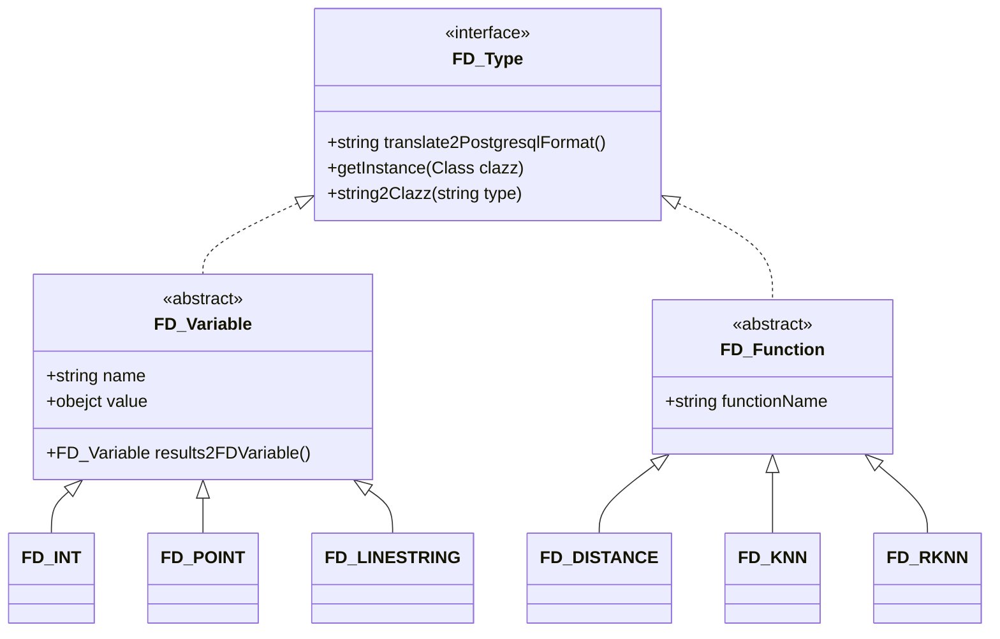
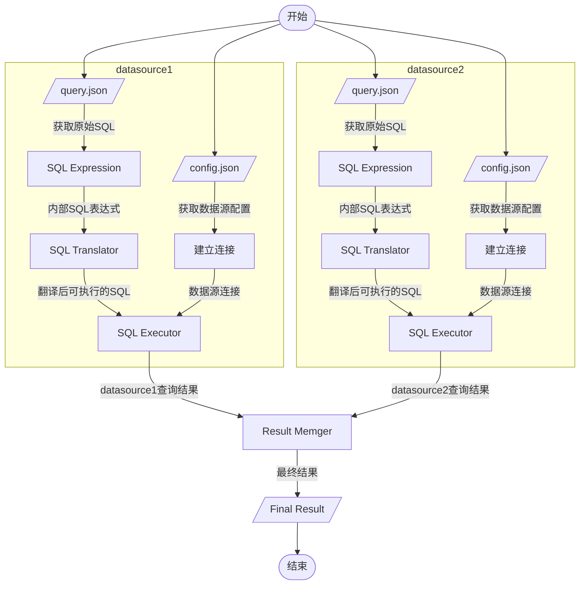

# DataFederateSystem

## Program Entry

```
com.suda.federate.application.Main.main()
```

## Requirement

* Apache Maven 3.6.0+
* Java 8
* PostgreSQL 13 + PostGIS 3.0

## Start

- debug
  1. edit `config.json` and `query.json` in DataFederateSystem/src/main/resources
  1. run com.suda.federate.application.Main.main()


- release
  1. edit `config.json` and `query.json` in DataFederateSystem/release
  1. `package.sh`  or  `package.bat``
  1. ``run.sh` or `run.bat`


## Design

### class diagram

未完成



### workflow

- 从 query.json 中读取 original sql （我们定义的SQL）和 variables

- 解析 variables 生成 FD_Variable 对象
- 将 original sql 和 FD_Variable 传递给 SQLTranslator，生成翻译后的 SQL（能够被对应database直接执行的SQL）
- SQL Optimizer
- SQL Executor
- Result Memger



## Federate Variable & Function

定义几种需要的 variable Type，比如

- 基础数据类型
  - `FD_Int`
  - `FD_String`
  - `FD_Double`

- 空间数据类型
  - `FD_Point`：二维空间上的一个坐标，使用空格隔开： `"value":"583571 4506714"`
  - `FD_Line`：多个 FD_Point 构成的集合，使用逗号隔开：`"value":"588881 4506445, 590946 4521077, 5941796 4503794, 600689 4506179, 578274 4499580"`


定义几种允许执行的 function，比如

- `FD_Distance (Point p1, Point p2) `: 返回 p1 和 p2 的距离

- `FD_KNN (Point p, F.loaction, k) `: 返回在 F 中 p 的 k 近邻点
- `FD_RKNN`
- ~~FD_RangeCount~~
- ~~FD_RangeSearch~~

## 查询规范

相关说明

- 支持单个查询（json格式），多个查询（json_array格式）[JSON在线解析及格式化验证 - JSON.cn](https://www.json.cn/#)
- variables 字段中支持的 type 为 ENUM.FD_DATA_TYPE 中所定义的枚举类型（与Federate Variable一一对应），不要写成`FD_Int`这样，以为准ENUM.FD_DATA_TYPE中的字符串为准，大小写不敏感。
- variables 的 name，用 $var_name 表示一个变量， 大小写敏感。
- 函数名称，大小写敏感。

FD_Distance

```json
{
  "注": "origin和target，程序中不会使用到，为了方便测试，留在了这里，json没有注释的语法",
    "origin": "select id, FD_Distance($P, location) as dis from nyc_data where FD_Distance($P, location) < 1000 order by dis;",
    "target": "select id,ST_distance(ST_GeomFromText('POINT(583571.0 4506714.0)',st_srid(location)), location) as dis from nyc_data where ST_distance(ST_GeomFromText('POINT(583571.0 4506714.0)',st_srid(location)), location) < 1000 order by dis limit 10",
  "columns":[
    "id",
    "FD_Distance($P, location) as dis"
  ],
  "table":"nyc_data",
  "filter":[
    "FD_Distance($P, location) < 1000"
  ],
  "order":"dis",
  "limit":10,
  "variables":[
    {
      "name":"P",
      "type":"point",
      "value":"583571 4506714"
    }
  ]
}
```

# 测试表格式

测试表（共4w条数据）：

- 10.10.64.117:54323/gis
  - osm_sh
  - DELETE from osm_sh where id <= 4963651393;
- 10.10.64.117:54322/gis
  - osm_sh
  - DELETE from osm_sh where id > 4963651393;

| id        | location                      | user       | timestamp           |
| --------- | ----------------------------- | ---------- | ------------------- |
| 172817255 | POINT(31.2030452 121.3360092) | XD346      | 2021-03-30 17:00:23 |
| 172817276 | POINT(31.1820961 121.337143)  | Austin Zhu | 2017-01-20 08:48:04 |
| 172817294 | POINT(31.1992382 121.3362152) | XD346      | 2021-03-30 17:00:23 |

