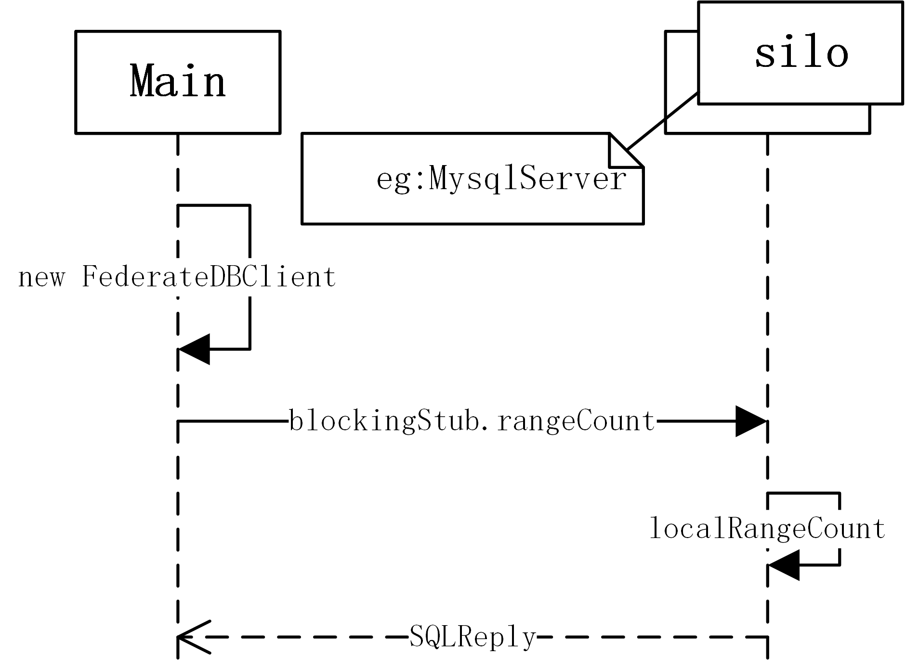

# DataFederateSystem

## Program Entry

```
com.suda.federate.application.Main.main()
```

## Requirement

* Apache Maven 3.6.0+
* Java 8
* PostgreSQL 13 + PostGIS 3.0
* MySQL 8.0+

## Start

- debug
  1. edit `config.json` and `query.json` in DataFederateSystem/src/main/resources
  1. run com.suda.federate.application.Main.main()


- release
  1. edit `config.json` and `query.json` in DataFederateSystem/release
  1. `package.sh`  or  `package.bat`
  1. ``run.sh` or `run.bat`


## Design

### workflow



```mermaid
%% graph TD
%%     start([开始])
%%     start-->d1_input2

%% d1_input2[/query.json/]    
%% d1_input2-->|json string|d1_expresssion[SQL Expression]
%% d1_expresssion-->|"Function and Variables"|d1_generator[SQL Generator]

%% d1_generator-->|target sql|DB_A[(Database A)]
%% d1_generator-->|target sql|DB_B[(Database A)]
%% d1_generator-->|target sql|DB_C[(Database A)]

%% subgraph node1
%%     DB_A[(Database A)]
%% end

%% subgraph node2
%%     DB_B[(Database B)]
%% end

%% subgraph node3
%%     DB_C[(Database C)]
%% end

%% memger[SetUnion or Summation]
%% DB_A-->|local result|memger
%% DB_B-->|local result|memger
%% DB_C-->|local result|memger

%% memger-->final_resulat[/Final Result/]
%% final_resulat-->end_([结束])
```

## Function

当前支持三种查询，RangeCount，RangeQuery，KNN

### RangCount

函数原型

```java
/**
 * query: select RangeCounting (P, radius) from table_name;
 * result: Integer，The number of points whose distance from P < radius in. table_name.
 *
 * @param point  query location
 * @param radius range count radius
 */
Integer RangeCount(FD_Point point, Double radius)l
```

query.json

```json
{
    "function":"RangeCount",
    "params":[
        {
            "type":"point",
            "value":"121.456107 31.253359"
        },
        {
            "type":"Double",
            "value":5000
        }
    ]
}
```

### RangeQuery

函数原型

```java
/**
 * query: select RangeQuery (P, radius) from table_name;
 * result: List<Point>，points whose distance from P < radius in table_name.
 *
 * @param point  query location
 * @param radius range count radius
 */
List<FD_Point> RangeQuery(FD_Point point, Double radius);
```

query.json

```json
{
    "function":"RangeQuery",
    "params":[
        {
            "type":"point",
            "value":"121.456107 31.253359"
        },
        {
            "type":"Double",
            "value":5000
        }
    ]
}
```

### Knn

函数原型

```java
/**
 * query: select Knn (P, K) from table_name;
 * result: List<Point>，The K nearest neighbors of point P in table_name.
 *
 * @param point query location
 * @param k "K" nearest neighbors
 */
List<FD_Point> Knn (FD_Point point, Integer K);
```

query.json

```json
{
    "function":"Knn",
    "params":[
        {
            "type":"point",
            "value":"121.456107 31.253359"
        },
        {
            "type":"int",
            "value":10
        }
    ]
}
```

## GRPC

### 编写步骤

1. 编写.proto文件

   1. 创建service 

      ```protobuf
      service Federate {
      	rpc RangeCount (SQLExpression) returns (SQLReply) {}
      }
      ```

      

   2. 创建request message

      ```protobuf
      message SQLExpression{
        optional int32 id =9;
        repeated int32 idList=10;
        ....
      }
      ```

   3. 创建response message

      ```protobuf
      message SQLReply {
        repeated int32 fakeLocalSum =2;
        required double message = 1;
      }
      ```
   
2. maven编译

   1. 配置proto编译后生成java路径

   ```xml
      <configuration>
                          <protocArtifact>com.google.protobuf:protoc:${protoc.version}:exe:${os.detected.classifier}</protocArtifact>
                          <pluginId>grpc-java</pluginId>
      <!--                    <&#45;&#45; 指定输出的base基础路径->-->
                          <outputDirectory>src/main/java</outputDirectory>
      <!--                    是否清除输出目录下的文件，默认为true，表示会将指定的输出路径下的全部文件都进行清空-->
      <!--                    如果自己配置了outputDirectory，请将这项配置改为false&ndash;&gt;-->
                          <clearOutputDirectory>false</clearOutputDirectory>
                      <pluginArtifact>io.grpc:protoc-gen-grpc-java:${grpc.version}:exe:${os.detected.classifier}</pluginArtifact>
                      </configuration>
   ```
   
   2. 运行maven，生成如下文件(rpc目录)
   
      ```java
      package com.suda.federate.rpc;
      
      public final class FederateService {
      	...
      }
      ```
   
      

### 通信过程

1. client端（发送request message）

   ```java
   package com.suda.federate.application;
   public final class FederateDBClient {
   	//客户端方法
   	private final FederateGrpc.FederateBlockingStub blockingStub; 
       public FederateService.SQLReply rangeCount(FederateService.SQLExpression expression){
           FederateService.SQLReply response;
           try{
               response = blockingStub.rangeCount(expression);
           }catch (StatusRuntimeException e){
               System.out.println("RPC调用失败："+e.getMessage());
               return null;
           }
           return response;
       }
   }
   ```

2. server端（接收request  message，返回response message）
	```java
   package com.suda.federate.silo;
   // 定义一个实现服务接口的类
   public abstract class FederateDBService extends FederateGrpc.FederateImplBase {
    
   }
   
   // silo 
   public class MysqlServer extends FederateDBServer {
           private static class FederateMysqlService<T> extends FederateDBService {
               //重写
               @Override
               public void rangeCount(FederateService.SQLExpression request, StreamObserver<FederateService.SQLReply> responseObserver) {
                   System.out.println("收到的信息：" + request.getFunction());
                   Integer result=0;
                   try {
   
                       result = localRangeCount(request.getPoint(),request.getTable(), request.getLiteral());
                       //构造返回
                       FederateService.SQLReply reply = setSummation(request,result);
                       responseObserver.onNext(reply);
                       responseObserver.onCompleted();
                   } catch (SQLException | InvocationTargetException | NoSuchMethodException | InstantiationException | IllegalAccessException e) {
                       e.printStackTrace();
                   }
               }
           }
	}
	
	```

其中`rpc RangeCount (SQLExpression) returns (SQLReply) {}` 

- 对应client端`blockingStub.rangeCount(expression);` 
- 和 server端的 `@Override public void rangeCount(FederateService.SQLExpression request, StreamObserver<FederateService.SQLReply> responseObserver)` 


## 相关规范说明

- 支持单个查询（json格式），多个查询（jsonArray格式）[JSON在线解析及格式化验证 - JSON.cn](https://www.json.cn/#)
- 函数名称，大小写不敏感，RangeCount 或者 FD_RangeCount 均可。
- 参数类型，大小写不敏感，int 或 FD_int 均可。


测试数据库（共4w条数据）：

- `jdbc:mysql://10.10.64.117:33061/gis`
  - osm_sh
  - DELETE from osm_sh where id <= 4963651393;
- `jdbc:postgresql://10.10.64.117:54322/gis`
  - osm_sh
  - DELETE from osm_sh where id > 4963651393;

| id        | location                      | user       | timestamp           |
| --------- | ----------------------------- | ---------- | ------------------- |
| 172817255 | POINT(31.2030452 121.3360092) | XD346      | 2021-03-30 17:00:23 |
| 172817276 | POINT(31.1820961 121.337143)  | Austin Zhu | 2017-01-20 08:48:04 |
| 172817294 | POINT(31.1992382 121.3362152) | XD346      | 2021-03-30 17:00:23 |

