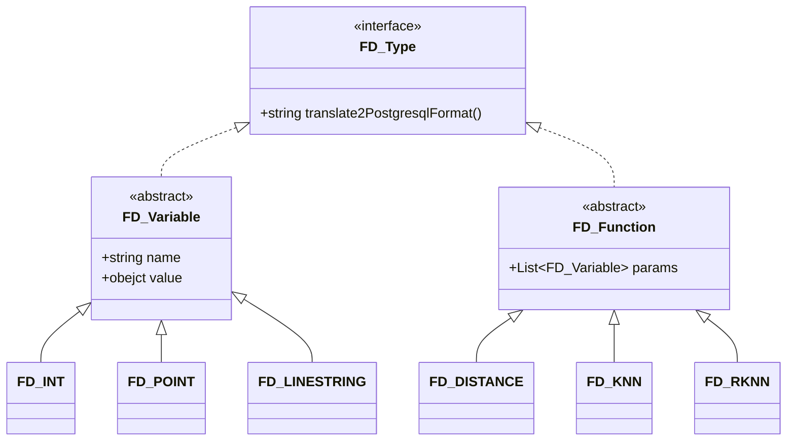

# DataFederateSystem

## Program Entry

```
com.suda.federate.application.Main.main()
```

## Requirement

* Apache Maven 3.6.0+
* Java 8
* PostgreSQL 13 + PostGIS 3.0

## Start

- debug
  1. edit `config.json` and `query.json` in DataFederateSystem/src/main/resources
  1. run com.suda.federate.application.Main.main()


- release
  1. edit `config.json` and `query.json` in DataFederateSystem/release
  1. `package.sh`  or  `package.bat``
  1. ``run.sh` or `run.bat`


## Design

### class diagram

未完成



### workflow

- 从 query.json 中读取 original sql （我们定义的SQL）和 variables

- 解析 variables 生成 FD_Variable 对象
- 将 original sql 和 FD_Variable 传递给 SQLTranslator，生成翻译后的 SQL（能够被对应database直接执行的SQL）
- SQL Optimizer
- SQL Executor
- Result Memger


## Federate Variable & Function

定义几种需要的 variable Type，比如

- 基础数据类型
  - `FD_Int`
  - `FD_String`
  - `FD_Double`

- 空间数据类型
  - `FD_Point`：二维空间上的一个坐标，使用空格隔开： `"value":"583571 4506714"`
  - `FD_Line`：多个 FD_Point 构成的集合，使用逗号隔开：`"value":"588881 4506445, 590946 4521077, 5941796 4503794, 600689 4506179, 578274 4499580"`


定义几种允许执行的 function，比如

- `FD_Distance (Point p1, Point p2) `: 返回 p1 和 p2 的距离

- `FD_KNN (Point p, F.loaction, k) `: 返回在 F 中 p 的 k 近邻点
- `FD_RKNN`
- ~~FD_RangeCount~~
- ~~FD_RangeSearch~~

## 查询示例

相关说明

- 支持单个查询（json格式），多个查询（json_array格式）[JSON在线解析及格式化验证 - JSON.cn](https://www.json.cn/#)

- query 字段中使用 $var_name 表示一个变量

- variables 字段中支持的 type 为 ENUM.FD_DATA_TYPE 中所定义的枚举类型。（与Federate Variable一一对应）

测试表（共3982条数据）：

- 10.10.64.117:54321/gis
  - nyc_data
  - `DELETE from nyc_data where id > 2000`
- 10.10.64.117:54322/gis
  - nyc_data
  - `DELETE from nyc_data where id <= 2000`

测试表格式

| id   | location                                 |
| ---- | ---------------------------------------- |
| 1    | POINT(592158.665764157 4502210.89236731) |
| 2    | POINT(588654.951612275 4517855.38265668) |
| 3    | POINT(605800.81502458 4505730.60839577)  |


FD_Distance

```json
{
  "query": "select F.id, FD_distance($P,F.location) as dis from nyc_homicides_copy where FD_distance($P F.location) < $K order by dis;",
  "variables": [
    {
      "name": "P",
      "type": "point",
      "value": "583571,4506714"
    },
    {
      "name": "K",
      "type": "int",
      "value": 100
    }
  ]
}
```


```json
{
    "query":"select id, location from nyc_homicides_copy where FD_Contains(ST_GeomFromText(LINESTRING (poly_point_set)), location);",
    "variables":[
      {
        "name":"poly_point_set",
        "type":"lineString",
        "value":"588881 4506445, 590946 4521077, 5941796 4503794, 600689 4506179, 578274 4499580"
      }
    ]
  }
```


