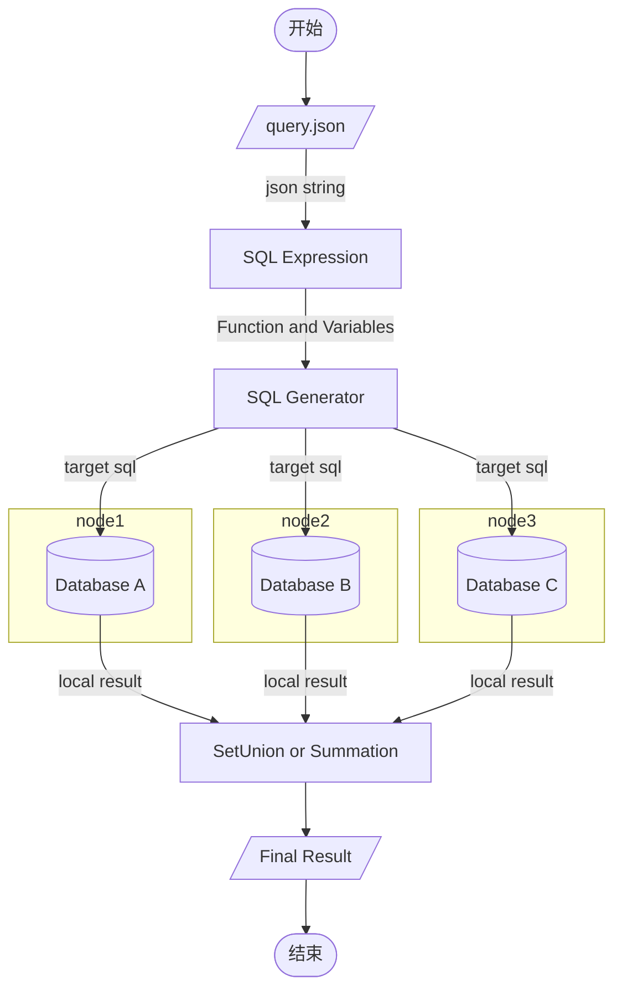

# DataFederateSystem

## Program Entry

```
com.suda.federate.application.Main.main()
```

## Requirement

* Apache Maven 3.6.0+
* Java 8
* PostgreSQL 13 + PostGIS 3.0
* MySQL 8.0+

## Start

- debug
  1. edit `config.json` and `query.json` in DataFederateSystem/src/main/resources
  1. run com.suda.federate.application.Main.main()


- release
  1. edit `config.json` and `query.json` in DataFederateSystem/release
  1. `package.sh`  or  `package.bat`
  1. ``run.sh` or `run.bat`


## Design

### workflow

简单流程如下（较为复杂的 KNN 查询过程，存在多次生成目标SQL语句并执行的过程）

- 从 query.json 中读取查询方法 function 和参数 params，生成 SQLExperssion
- SQLExpression --> FD_Function --> SQLGenerator，生成目标数据库查询 SQL

- 遍历所有 data silos，执行查询

- 查询结果做 summation、union 等。



### Type

- `FD_Point`：二维空间上的一个坐标，使用空格隔开： `"value":"121.456107 31.253359"`
- `FD_LineString`：多个 FD_Point 构成的集合，使用逗号隔开：`"value":"121.43 31.20, 121.46 31.20, 121.46 31.23, 121.43 31.20"`
- `FD_Polygon`：多个 FD_Point 构成的集合，使用逗号隔开：`"value":"121.43 31.20, 121.46 31.20, 121.46 31.23, 121.43 31.20"`

## Function

当前支持三种查询，RangeCount，RangeQuery，KNN

### RangCount

函数原型

```java
/**
 * query: select RangeCounting (P, radius) from table_name;
 * result: Integer，The number of points whose distance from P < radius in. table_name.
 *
 * @param point  query location
 * @param radius range count radius
 */
Integer RangeCount(FD_Point point, Double radius)l
```

query.json

```json
{
    "function":"RangeCount",
    "params":[
        {
            "type":"point",
            "value":"121.456107 31.253359"
        },
        {
            "type":"Double",
            "value":5000
        }
    ]
}
```

### RangeQuery

函数原型

```java
/**
 * query: select RangeQuery (P, radius) from table_name;
 * result: List<Point>，points whose distance from P < radius in table_name.
 *
 * @param point  query location
 * @param radius range count radius
 */
List<FD_Point> RangeQuery(FD_Point point, Double radius);
```

query.json

```json
{
    "function":"RangeQuery",
    "params":[
        {
            "type":"point",
            "value":"121.456107 31.253359"
        },
        {
            "type":"Double",
            "value":5000
        }
    ]
}
```

### Knn

函数原型

```java
/**
 * query: select Knn (P, K) from table_name;
 * result: List<Point>，The K nearest neighbors of point P in table_name.
 *
 * @param point query location
 * @param k "K" nearest neighbors
 */
List<FD_Point> Knn (FD_Point point, Integer K);
```

query.json

```json
{
    "function":"Knn",
    "params":[
        {
            "type":"point",
            "value":"121.456107 31.253359"
        },
        {
            "type":"int",
            "value":10
        }
    ]
}
```

### RKnn


## 相关规范说明

- 支持单个查询（json格式），多个查询（jsonArray格式）[JSON在线解析及格式化验证 - JSON.cn](https://www.json.cn/#)
- 函数名称，大小写不敏感，RangeCount 或者 FD_RangeCount 均可。
- 参数类型，大小写不敏感，int 或 FD_int 均可。


测试数据库（共4w条数据）：

- `jdbc:mysql://10.10.64.117:33061/gis`
  - osm_sh
  - DELETE from osm_sh where id <= 4963651393;
- `jdbc:postgresql://10.10.64.117:54322/gis`
  - osm_sh
  - DELETE from osm_sh where id > 4963651393;

| id        | location                      | user       | timestamp           |
| --------- | ----------------------------- | ---------- | ------------------- |
| 172817255 | POINT(31.2030452 121.3360092) | XD346      | 2021-03-30 17:00:23 |
| 172817276 | POINT(31.1820961 121.337143)  | Austin Zhu | 2017-01-20 08:48:04 |
| 172817294 | POINT(31.1992382 121.3362152) | XD346      | 2021-03-30 17:00:23 |

